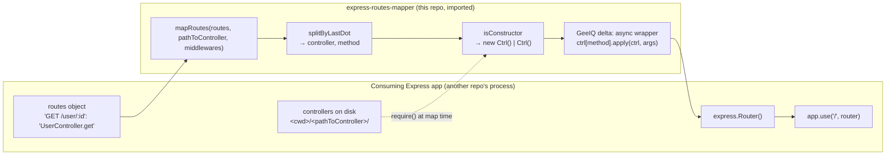

# `express-routes-mapper` — GeeIQ fork

> A GeeIQ fork of the public npm package [`express-routes-mapper`](https://github.com/aichbauer/express-routes-mapper)
> by Lukas Aichbauer, carrying one behavioural change to the route handler.

- **Type:** Library (JavaScript / Express middleware factory) — fork of third-party software
- **Purpose:** Turn a plain object of `'<METHOD> /<path>': 'Controller.method'` route
  definitions into an `express.Router()`, resolving controller files from disk at map time.
  The GeeIQ delta makes the mapped handler call the controller method **on its controller
  instance**, so `this` is usable inside class-based controllers.
- **Status:** Dormant. Nothing is deployed, nothing is published under this fork's name, and
  no repository in the estate depends on it — see [Consumption and liveness](#consumption-and-liveness).

This document is the GeeIQ-side documentation for this repository. Upstream's `README.md` is
left byte-for-byte as its author wrote it and describes the upstream library's API, which the
fork does not change. Everything specific to this org lives here.

## Contents

- [Provenance — what this fork is](#provenance--what-this-fork-is)
- [The GeeIQ delta](#the-geeiq-delta)
- [How a consumer uses it](#how-a-consumer-uses-it)
- [Name chain](#name-chain)
- [Architecture context](#architecture-context)
- [Import surface](#import-surface)
- [Export inventory](#export-inventory)
- [Release — how a version would be published](#release--how-a-version-would-be-published)
- [Consumption and liveness](#consumption-and-liveness)
- [Data access](#data-access)
- [Outputs and side effects](#outputs-and-side-effects)
- [Configuration](#configuration)
- [Tooling — tests, linting, CI](#tooling--tests-linting-ci)
- [Further reading](#further-reading)

---

## Provenance — what this fork is

This is a **GitHub fork of third-party software**, not first-party code that happens to share
a public package's name. Four independent facts establish it:

| Fact | Evidence |
|---|---|
| GitHub records it as a fork | `gh repo view --json isFork,parent` → `isFork: true`, `parent: aichbauer/express-routes-mapper`. Per the pass's own rule, a `true` here is reliable; only a `false` would need corroborating. |
| The history is upstream's, not a local import | The root commit is `80667f6` *"init commit"* (2017-03-07) by `rudolfsonjunior`, upstream's author under his earlier handle. 120 of the 123 commits are upstream's, by upstream contributors. |
| The object database is genuinely shared with upstream | Querying the parent repo's API for this fork's own commit (`repos/aichbauer/express-routes-mapper/commits/ccef7c7…`) resolves, which is only possible inside a GitHub fork network. This is the discriminator against a *copy-forward*, where the two histories are separate object stores that merely look alike. |
| The repo creation date matches the first in-house commit, not the root commit | Repo `createdAt` `2021-01-13T11:02:34Z`; the first GeeIQ commit `ccef7c7` is `2021-01-13T11:05:57Z`, three minutes later. Consistent with "forked, then edited", and inconsistent with a locally-built history pushed into a new repo. |

**The fork is level with upstream.** Upstream's `master` tip is `9f6fa58` (2020-02-14) and
upstream's newest tag is `v1.1.0` — both are also the fork point here, so this fork is not
behind upstream and has no upstream changes to pull. Upstream is unarchived but has not been
pushed since 2022-12-09.

**Repository visibility: public.** Anything committed here is world-readable.

Because the ratio is 120 upstream commits to 3 in-house, this document is shaped as a fork
document (the delta is the subject) rather than as a library document, though the library
questions — publish story, entry point, export inventory, consumers — are answered below.

## The GeeIQ delta

Three commits in this repository are GeeIQ's. Only one changes behaviour.

| Commit | Date | What it does |
|---|---|---|
| `ccef7c7` | 2021-01-13 | *"Allow `this` to be used in the context of class based route definitions."* Six inserted lines, one deleted, in `src/index.js`. |
| `85a326b` | 2026-06-08 | ENG-5704 runtime pinning: adds `.nvmrc` (`10`), `engines.node ^10.0.0`, and `CLAUDE.md` documenting the bump procedure. No source change. |
| `7a81d2c` | 2026-06-23 | Merge of PR #1 (the commit above). Tagged `v1.1.1`. |

`git diff 9f6fa58 HEAD -- src/` is the whole functional delta, and it is this:

```js
// upstream
router.route(myPath)[requestMethod](middlewares, contr[controllerMethod]);

// this fork
let routeFn = (function(ctrl, mthd) {
  return async (...args) => {
    return ctrl[mthd].apply(ctrl, args);
  };
})(contr, controllerMethod);

router.route(myPath)[requestMethod](middlewares, routeFn);
```

Upstream passes the controller method as a bare function reference, so Express invokes it
detached from its instance and `this` inside a class-based controller is `undefined`. The fork
wraps it in a closure that `apply`s the method to the controller instance it was constructed
from, which is what makes `this` usable.

Two consequences of the wrapper that are worth knowing before reusing this code:

- The wrapper is `async`, so **every mapped handler returns a promise**, including handlers
  that were synchronous upstream. Express 4 (`express@^4.16.3` here) does not attach a
  rejection handler to a returned promise, so an error thrown inside a controller method
  surfaces as an unhandled rejection rather than reaching Express's error middleware.
- The wrapper accepts and forwards `(...args)`, so the `(req, res, next)` signature and any
  additional Express arguments pass through unchanged.

Nothing else diverges from upstream: the helpers (`src/helpers/isConstrutor.js`,
`src/helpers/splitByLastDot.js`), the test suite, `examples/`, `README.md`, `CHANGELOG.md`,
`LICENSE`, `.babelrc`, `.eslintrc`, `.npmignore` and `.travis.yml` are all upstream's,
unmodified.

## How a consumer uses it



Nothing in this diagram crosses a process or network boundary: the library runs inside the
consuming service, and the only external thing it touches is that service's own source tree.

## Name chain

| Link | Value |
|---|---|
| Repo | `express-routes-mapper` (CheckpointGG, public, fork of `aichbauer/express-routes-mapper`) |
| `package.json` `name` | `express-routes-mapper` — **unscoped, and upstream's own name.** Version `1.1.0`, upstream's value, unchanged by the fork. `author`, `repository.url`, `bugs.url` and `homepage` all still point at upstream. |
| Serverless `service:` / ECR image | none — library, and nothing is built into an image. No `serverless.{yml,ts}`, `Dockerfile`, `docker-compose.yml`, Kubernetes manifest, CDK app or `deploy/` directory has ever existed at any of the 123 commits on any of the 11 remote branches or 20 tags. |
| CloudFormation stack | none — nothing is provisioned. |
| Deployed K8s workload / Lambda function | none — a library runs inside the process of whatever imports it. |
| Event-source names | none — not invoked; consumed as a dependency. |
| Public host / API Gateway id | none — the repository names no hostname of its own. |
| CDN distribution id | none. |
| Other runtime labels | `v1.1.1` — a lightweight git tag on `7a81d2c`, created by GeeIQ. It is the only tag not inherited from upstream, it has **no** corresponding GitHub release, and `package.json` still reads `1.1.0`, so the tag and the package version disagree. |

## Architecture context

| Field | Detail |
|---|---|
| Part of | Nothing. It is not wired into any subsystem. |
| Role in platform | None currently. It was forked to serve GeeIQ Express APIs that map routes from a definition object. |
| Upstream dependencies | `express`, `object.entries`, `@babel/core`, `@babel/register`, `@babel/runtime`, plus Node's `util` and `path`. No datastore client and no HTTP client. |
| Downstream dependencies | None. The library makes no outbound call of its own — see [Data access](#data-access). |

Architecture docs: https://docs.geeiq.com/architecture/

## Import surface

A library is not invoked; it is imported. The real import is a default export:

```js
import mapRoutes from 'express-routes-mapper';        // ESM
const mapRoutes = require('express-routes-mapper');   // CJS — babel-plugin-add-module-exports
                                                      // makes the default export the module
```

- **Entry point:** `package.json` `main` is `lib/index.js`. **That path does not exist in the
  repository at any ref.** `lib` is the first line of `.gitignore` and was deliberately
  removed from git by upstream in `bba057a` *"Refactor: delete lib from git repo"* (2017-05-08);
  it exists only on tags `v0.0.2`–`v0.1.0`, which predate that commit. `lib/` is produced by
  `npm run babel` (`babel src --out-dir lib`), so the entry point is a **build output**, and a
  consumer who obtains this repository without running that build has a package whose `main`
  resolves to nothing.
- **Source of truth:** `src/index.js` (ESM, transpiled by Babel with
  `@babel/preset-env` + `@babel/plugin-transform-runtime` + `babel-plugin-add-module-exports`).
- **`files` / `publishConfig`:** neither field is declared in `package.json` at any ref.
  Packaging is governed by `.npmignore`, which excludes `src`, `test`, `examples`, `.babelrc`,
  `.eslintrc`, `.travis.yml` and `yarn.lock` — so a published tarball would carry `lib/`,
  `README.md`, `CHANGELOG.md`, `LICENSE` and `package.json`, and **not** the source.
  `.npmignore` does not exclude `docs/`, so this file would ship too.
- **Module format:** CommonJS after transpilation. No `module`/`exports` map, no ESM build, no
  TypeScript declarations.
- **Node:** `engines.node ^10.0.0` and `.nvmrc` `10`, both added by ENG-5704. Node 10 is
  end-of-life; the commit body records that this was a deliberate pin to the highest concrete
  major already declared in `.travis.yml` rather than a forward upgrade.

## Export inventory

One public export, plus two internal helpers that ship in the tarball but are not on the
public surface.

| Export | Signature | What it does |
|---|---|---|
| default (`mapRoutes`) | `mapRoutes(routes, pathToController, middlewareGenerals = []) → express.Router` | Builds a router from a route-definition object. See below. |

`mapRoutes` behaviour, per `src/index.js`:

- **Route keys** are `'<METHOD> <path>'`. Runs of whitespace are collapsed, and the method is
  lower-cased before being used as the `express.Router` method name, so any method Express
  supports works.
- **Route values** are either the string `'Controller.method'`, split on the *last* dot by
  `splitByLastDot`, or an object `{ path, middlewares }` where `path` takes the same string
  form and `middlewares` is an array appended after the group middlewares.
- **`pathToController`** is joined onto `process.cwd()`, so it is resolved relative to the
  working directory of the process — not relative to the calling module.
- **Controller resolution** is a synchronous `require` at map time. `isConstructor` decides
  between `new handler()` and `handler()`, supporting both the ES6-class and object-factory
  patterns. On any thrown error the code falls back to `require('@babel/register')` and
  re-requires taking `.default`, which is how it consumes untranspiled ESM controllers.
- **Middlewares** may be an array or a single function; `null`/`undefined` entries are
  filtered out. Group middlewares run before per-route middlewares, in array order.
- **The handler** is the GeeIQ wrapper described in [The GeeIQ delta](#the-geeiq-delta).

| Internal helper | Purpose |
|---|---|
| `src/helpers/splitByLastDot.js` | Splits `'A.B.method'` into `['A.B', 'method']` on the last dot, so dotted controller paths work. |
| `src/helpers/isConstrutor.js` | Returns whether a value can be `new`-ed, by attempting `new func()` in a `try`. Note the filename's missing `c` — it is upstream's spelling and the import in `src/index.js` matches it. |

## Release — how a version would be published

**Nothing publishes this fork, and there is no pinnable published artefact for it.** The
questions the pass asks about a library's publish story each have a definite negative answer
here, so they are recorded as facts rather than gaps:

- **Publish workflow:** none, at any ref. `.github/` has never existed — `git log --all
  --name-only` over all 123 commits yields no path under `.github/`, so this is the *never had
  CI* case rather than "CI that cannot fire". `gh api …/actions/workflows` returns
  `total_count: 0`. The only CI configuration the repository has ever had is upstream's
  `.travis.yml` (Node 6/8/10 on Travis CI's `trusty` dist), which is inherited, unmodified,
  and points at a service the org does not use.
- **Registry:** none configured. No `publishConfig`, no `.npmrc` at any ref, no scope on the
  package name. A bare `npm publish` from this working tree would therefore target
  `registry.npmjs.org` under the **unscoped name `express-routes-mapper`**, which upstream
  owns — so it would be rejected, not published. There is no route by which this fork's code
  can reach a registry under that name.
- **Build hook:** the only script that produces `lib/` on publish is `prepublish`. That hook
  was deprecated in npm 5 and no longer runs on `npm publish` in modern npm, so on any current
  toolchain a publish would ship a tarball with no `lib/` — i.e. no `main`.
- **Releases:** `gh release list` returns nothing. The `v1.1.1` tag has no release attached.
- **Version:** `package.json` has read `1.1.0` since upstream's `8fef717` (2018-11-23) and
  has never been changed by this org, so **the version has never moved under GeeIQ ownership**
  despite two in-house commits and one in-house tag.

**Therefore: no pinnable ref exists for the fork's behaviour.** The only install route that
would deliver the GeeIQ delta is a git dependency naming this repository explicitly, and it
would additionally have to run the Babel build, because `main` points at a path git does not
carry:

```jsonc
// hypothetical — no repository in the estate does this
"express-routes-mapper": "github:CheckpointGG/express-routes-mapper#v1.1.1"
```

## Consumption and liveness

**Verdict: dormant, and superseded. Nothing consumes this fork, and nothing ever did.**

For a library, liveness is publication and consumption rather than deploys. Both are
negative here, and the sequence explains why:

1. **2021-01-13** — the fork is created and `ccef7c7` adds the `this`-binding wrapper.
2. **2021-01-14** — the day after, the same author lands *"Removed ExpressRouteMapper for own
   implementation"* in a consuming repository, replacing the dependency with an in-repo
   route mapper that carries the same wrapper idea.
3. **2023-01-05** — the remaining consumer does likewise, in a commit titled *"Replaced
   express-route-mapper with custom handler"*.
4. **2026-06-08 / 2026-06-23** — ENG-5704 adds `.nvmrc` and `engines`, and PR #1 merges. This
   is estate-wide maintenance, not use: its own commit body records that no CI exists to read
   `.nvmrc` and that there is no Dockerfile or serverless runtime to align.

The fork's one functional commit was therefore overtaken within a day by in-repo
implementations, and the package identity that consumers had installed was upstream's
published `express-routes-mapper@^1.1.0` from `registry.npmjs.org` — never this fork. So the
delta reached production, if at all, only by being re-typed into consuming repositories, not
by being installed from here.

Recency is not evidence of use in either direction here: the 2026 commit is a runtime-pinning
sweep that touched no source, and the 2020 upstream commit is a Dependabot bump inside
`examples/`.

**What cannot be established from inside this repository:** a library holds no record of its
importers, so the absence of consumers is not provable from here. It was established by
searching sibling clones (there is no working GitHub code search for this org) and is
recorded in this pass's findings file rather than asserted as a property of this repository.

## Data access

**None. This section is deliberately empty and that is the accurate answer, not a gap.**

There is no table, collection, index, bucket path, cache key, topic, stored-procedure call or
SQL statement of any kind anywhere in this repository at any of the 123 commits on any of its
11 branches or 20 tags, and no datastore client among its dependencies. The library's only
runtime behaviour is `require`-ing controller modules from disk and registering handlers on an
`express.Router`.

More importantly, **even if it did carry a query, the access would belong to the caller.** A
library is documented with no data-access rows so that the per-table pass does not
double-count: a service whose controllers read or write `checkpoint_gg` lists those tables in
its own documentation, and attributing them here as well would credit a package that never
opens a connection.

## Outputs and side effects

- Reads controller modules from the filesystem at map time, via `require` of
  `path.join(process.cwd(), pathToController) + controller`. This is a read of the calling
  process's own source tree.
- Registers routes on the `express.Router` it returns, which mutates that router.
- On the fallback path, `require('@babel/register')` installs Babel's **global require hook**
  into the calling process, which changes how every subsequent `require` in that process is
  compiled. This is a process-wide side effect of a failed controller `require`, and it
  persists after `mapRoutes` returns.

## Configuration

**No configuration surface.** `process.env` is not read anywhere in this repository at any
ref — the only `process` use is `process.cwd()`. There is no `.env.example` and no
configuration module, and nothing for a consumer to set: the two behavioural inputs
(`pathToController` and the middleware list) are function arguments.

Deliberately not applicable here, rather than skipped: the library carve-out on documenting
configuration is only wrong when the env surface is part of a library's public API, and this
library has no env surface at all.

## Tooling — tests, linting, CI

Stated plainly, including the absences, because tooling absences are useful facts.

- **Tests:** present. `test/src/index.js` and `test/src/require.js`, run with **AVA**
  (`ava@^0.18.2`) under `nyc` coverage, against four fixture controllers in
  `test/fixtures/controllers/` covering the class/function × `export default`/`module.exports`
  matrix. `npm test` is `cross-env NODE_ENV=test nyc ava`, and `pretest` runs `npm run lint &&
  npm run babel` first.
- **Linter:** ESLint 3 with `eslint-config-airbnb-base`, via `.eslintrc`. `npm run lint`
  lints **only `./src/index.js`** — not the helpers, not the tests.
- **Git hooks:** `husky@^0.13.2` with `precommit` → lint and `prepush` → test. These only run
  for a developer who has installed dependencies locally.
- **CI:** **none.** No GitHub Actions workflow has ever existed at any ref, so no push, tag or
  pull request receives an automated check, and PR #1 was merged unchecked. Upstream's
  `.travis.yml` is inherited and inert.
- **Coverage reporting:** `coveralls` is wired through the Travis `after_success` step, so it
  is inert for the same reason. The badges at the top of upstream's `README.md` point at
  Travis CI and Coveralls builds of **upstream's** repository, not this fork.
- **Node version:** `.nvmrc` `10` and `engines.node ^10.0.0`. Nothing reads `.nvmrc`, since
  there is no `actions/setup-node` step to point at it.

## Further reading

- Upstream repository and API documentation: https://github.com/aichbauer/express-routes-mapper
- Upstream's own `README.md` in this repository — the library's public API, unmodified.
- [`CHANGELOG.md`](../CHANGELOG.md) — upstream's changelog, last entry `1.1.0` (2018-11-23).
  It records no GeeIQ change.
- [`examples/README.md`](../examples/README.md) — upstream's runnable ES6 example app
  (`examples/app/`). It depends on the **published** `express-routes-mapper@^0.1.1` from the
  registry, not on the source in this repository.
- [`CLAUDE.md`](../CLAUDE.md) — the Node bump procedure recorded by ENG-5704.
